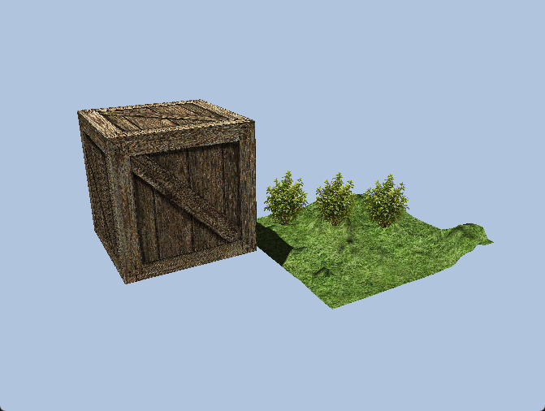
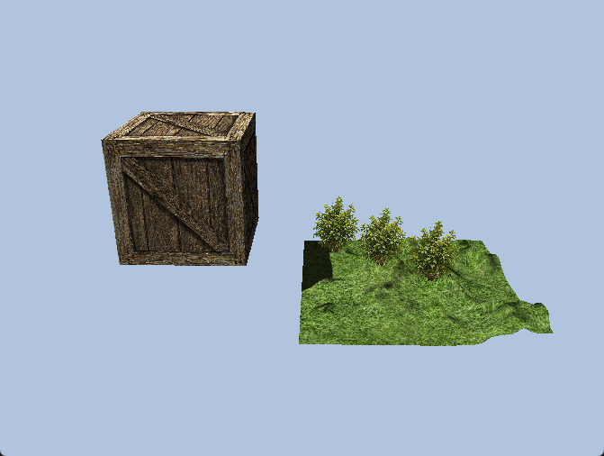
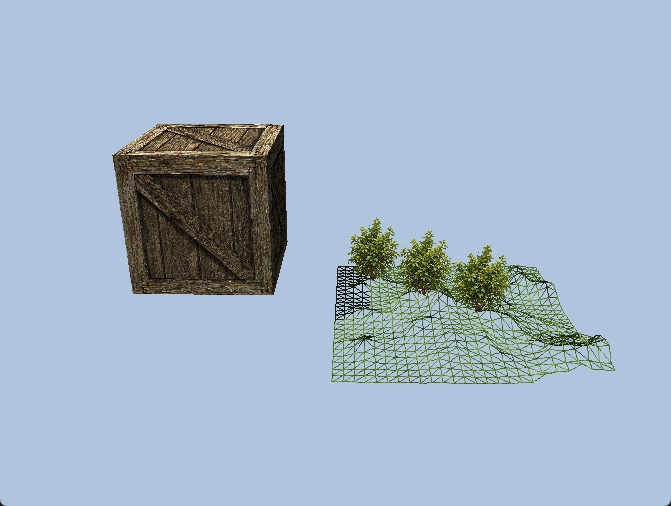

# DirectX 12 Rendering Sandbox

A real-time graphics sandbox built with **C++17, DirectX 12, and HLSL**.

The project combines several rendering techniques in a single scene, including
dynamic tessellation, displacement mapping, normal mapping, directional shadow
mapping, and geometry-shader billboards.

<p align="center">
  
</p>

## Features

### Tessellated Terrain
- Quad-patch terrain rendered with Hull and Domain shaders
- Dynamic tessellation based on camera distance
- Height-map displacement in the Domain Shader
- Terrain normals reconstructed from neighboring height-map samples
- Textured Lambert lighting
- Runtime solid / wireframe visualization

### Normal Mapping
- Tangent-space normal mapping on the textured cube
- Per-face vertex tangents
- TBN transformation from tangent space to world space
- Lambert diffuse lighting with Blinn-Phong specular highlights

### Shadow Mapping
- Directional-light shadow mapping
- Separate depth-only shadow pass
- 2048 × 2048 shadow map
- Shadow rendering for both the cube and tessellated terrain
- 3 × 3 Percentage-Closer Filtering (PCF)
- Rasterizer depth bias and receiver bias to reduce shadow artifacts

### Geometry Shader Billboards
- Point-list input expanded into quads in a Geometry Shader
- Cylindrical camera-facing billboards
- Alpha-clipped vegetation textures
- Depth-tested integration with the rest of the scene

### DirectX 12 Rendering Pipeline
- Multiple Graphics Pipeline State Objects
- Descriptor heaps and Shader Resource Views
- Per-object and per-scene constant buffers
- Separate pipelines for:
  - textured geometry
  - tessellated terrain
  - shadow rendering
  - geometry-shader billboards
  - terrain wireframe visualization

## Screenshots

### Solid Rendering

<p align="center">
  
</p>

### Tessellation Wireframe

<p align="center">
  
</p>

The wireframe view exposes the geometry generated by the tessellation stage
after height-map displacement.

## Controls

| Input | Action |
| --- | --- |
| Left Mouse Button + Drag | Orbit the camera |
| Right Mouse Button + Drag | Zoom in / out |
| `W` | Toggle terrain solid / wireframe rendering |
| `Esc` | Exit |

## Technical Stack

- **Language:** C++17
- **Graphics API:** DirectX 12
- **Shaders:** HLSL / Shader Model 5.0
- **Platform:** Windows
- **Build system:** Visual Studio / MSVC
- **Project format:** Visual Studio 2022 (`v143` toolset)

## Rendering Overview

The frame is rendered in two main stages.

### 1. Shadow Pass

The scene is first rendered from the directional light's point of view into a
depth texture.

The cube uses a standard depth-only pipeline, while the terrain uses its own
Hull and Domain shaders so that the geometry written to the shadow map matches
the displaced tessellated surface.

### 2. Main Pass

The scene is then rendered from the camera:

- the cube uses texturing, normal mapping, Lambert diffuse lighting,
  Blinn-Phong specular lighting, and shadow sampling;
- the terrain uses dynamic tessellation, height displacement, reconstructed
  normals, lighting, and shadow sampling;
- vegetation points are expanded into camera-facing quads by the Geometry Shader.

The shadow map is sampled using a comparison sampler and a 3 × 3 PCF kernel.

## Project Structure

```text
DirectX12-Rendering-Sandbox/
├── DirectX12RenderingSandbox.sln
├── DirectX12RenderingSandbox/
│   ├── RenderWidget.cpp
│   ├── RenderWidget.h
│   ├── GeometryHelper.cpp
│   ├── GeometryHelper.h
│   ├── System.cpp
│   ├── System.h
│   │
│   ├── Basic.hlsl
│   ├── Tessellation.hlsl
│   ├── Shadow.hlsl
│   ├── Billboard.hlsl
│   ├── ShaderConstants.hlsli
│   └── ShadowCommon.hlsli
│
├── docs/
│   └── images/
│       ├── scene-closeup.png
│       ├── overview-solid.png
│       └── overview-wireframe.png
│
└── external/
```

### Key Files

- `RenderWidget.cpp` — DirectX 12 initialization, resource creation, PSOs,
  shadow pass, and main rendering pass
- `GeometryHelper.*` — geometry data, camera utilities, texture loading helpers
- `Basic.hlsl` — cube rendering, normal mapping, lighting, and shadows
- `Tessellation.hlsl` — dynamic tessellation, displacement, terrain normals,
  lighting, and shadows
- `Shadow.hlsl` — depth-only cube and tessellated terrain shadow pipelines
- `Billboard.hlsl` — Geometry Shader vegetation billboards
- `ShaderConstants.hlsli` — shared shader configuration
- `ShadowCommon.hlsli` — shared PCF shadow sampling logic

## Building and Running

### Requirements

- Windows 10 or Windows 11
- Visual Studio 2022
- MSVC `v143` toolset
- Windows SDK
- DirectX 12 capable graphics hardware

### Build

1. Clone the repository.
2. Open `DirectX12RenderingSandbox.sln`.
3. Select either `Debug | x64` or `Release | x64`.
4. Build the solution with `Ctrl + Shift + B`.
5. Run with `F5`.

Both **Debug x64** and **Release x64** configurations have been tested.

## Academic Background

The project originated from DirectX 12 laboratory exercises completed during
the **Graphics API Programming** course at the Silesian University of Technology.

The original exercises focused on individual graphics-pipeline concepts.
They were later consolidated and extended into this integrated rendering sandbox
with additional lighting, normal mapping, shadow mapping, Geometry Shader
billboards, runtime visualization controls, and shared rendering utilities.

## Author

**Alan Pawleta**

Computer Science — Interactive 3D Graphics  
Silesian University of Technology
